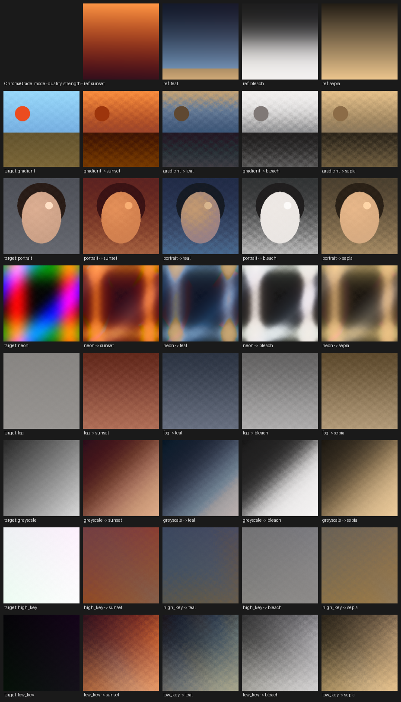

# ComfyUI-ChromaGrade

Reference-based AI colour matching for ComfyUI. Give it the image you want
graded and an image whose look you want; it transfers the **treatment** —
white balance, exposure, contrast, palette, shadow and highlight coloration —
without importing any of the reference's content.

No model weights. No downloads. No network access. Deterministic. Runs on CPU.



*Every scene above is generated procedurally by `tests/fixtures.py`; the sheet
is reproduced by `python tools/contact_sheet.py`.*

## Install

```bash
git clone https://github.com/MONKEYFOREVER2/ComfyUI-ChromaGrade
```

into `ComfyUI/custom_nodes/`, then restart ComfyUI. That is the whole
installation.

There is nothing to `pip install`: the node needs only `torch`, which ComfyUI
already provides. `requirements.txt` lists it so a standalone install works, but
pip will see it as satisfied inside a ComfyUI environment and will not touch
your CUDA build. `Pillow` is used by one optional dev tool and ships with
ComfyUI anyway.

**No model files are required or downloaded, ever.** If a colour-match node asks
you to fetch weights, it is not this one.

## The node

**AI Color Match (ChromaGrade)** — category `image/color`.

| Socket | Type | Meaning |
|---|---|---|
| `TARGET_IMAGE` | IMAGE | The image to grade. Its content, geometry, resolution and detail are preserved. |
| `COLOR_REFERENCE` | IMAGE | The image supplying the look. Only its colour statistics are read. |
| `IMAGE` (output) | IMAGE | The graded target, same batch/height/width/channels/dtype/device as it came in. |

Drop it between any image source and your save/preview node. The defaults are
tuned to produce a strong result with nothing else touched.

### Controls

| Control | Default | What it does |
|---|---|---|
| `mode` | `quality` | `quality` runs full distribution transfer plus per-lightness-band coloration. `fast` uses the closed-form transport only — about 3× quicker to fit, slightly less faithful on complex palettes, equally artefact-free. |
| `strength` | `1.0` | Blends the finished grade with the untouched target. `0.0` is a bit-exact pass-through. |
| `white_balance` | `1.0` | How far to carry the target's estimated illuminant onto the reference's. Lower it when the target's white balance is already right and you only want the palette. |
| `tonal_transfer` | `1.0` | Exposure, contrast and black/white point matching. `0.0` keeps the target's own tonality and transfers colour only. |
| `palette_transfer` | `1.0` | Chroma distribution matching: palette relationships, saturation character, shadow/highlight coloration. `0.0` keeps white balance and tonality only. |
| `skin_protection` | `0.5` | Holds hue steady inside the skin locus and caps chroma gain there. Lightness is never affected. Raise for portraits, drop for landscapes. |
| `detail_preservation` | `0.5` | Restores the target's original fine-detail amplitude after grading, using an edge-aware guided filter. Counteracts the grain and noise amplification any contrast expansion causes. `1.0` keeps detail exactly as it arrived; `0.0` makes the whole grade a pure 3D LUT. |
| `saturation` | `1.0` | Final chroma trim in Oklab, applied before gamut mapping. |

Every control is wired to something real — `tests/test_pipeline.py` fails if any
of them stops having an effect.

### Batch behaviour

| Target batch | Reference batch | Result |
|---|---|---|
| N | 1 | The one reference is broadcast to all N. |
| N | N | Pairwise: frame *i* is graded against reference *i*. |
| N | anything else | All reference frames are pooled into one combined colour distribution and broadcast. |

The output batch always matches the target's. Pooling is not a fallback — a
multi-frame reference gives a more stable grade than a single frame, so it is a
useful thing to do on purpose.

### Example workflow

`workflows/chromagrade_basic.json` — load a target, load a reference, match,
save. Drag it onto the ComfyUI canvas.

## How it works, in one paragraph

The grade is fitted from downsampled statistics: illuminant and exposure
normalisation in linear light, then a monotone slope-limited tone curve and
optimal-transport palette matching in Oklab, then skin and neutral protection
and a hue-preserving gamut mapper. Every one of those stages is a function of
colour alone, so the whole pipeline is evaluated once on a 33³ lattice, lightly
smoothed, and applied at full resolution as a 3D LUT with tetrahedral
interpolation. That is the key design choice: **a 3D LUT has no spatial extent,
so it cannot blur an edge, ring around one, or lose texture** — structure
preservation is a property of the representation rather than something to hope
for. One optional spatial stage follows (guided-filter detail restoration) to
undo the noise amplification that contrast expansion causes.

Full write-up, citations and measured results: [`docs/METHOD.md`](docs/METHOD.md).

## How good is it

Measured against Reinhard et al. (2001) on nine target/reference pairs
(`python tools/evaluate.py`):

* On six ordinary scenes, **2.4× to 8.9× closer** to the reference's colour
  distribution in sliced-Wasserstein terms.
* **Zero** fully clipped pixels anywhere in the suite; the baseline clips up to
  12 % of a frame.
* On deliberately flat targets the baseline gets a better distribution distance
  by force — on the high-key pair it does so at an SSIM of 0.299, i.e. by
  wrecking the image. ChromaGrade scores 0.744 there.

The full table, including where and why the baseline wins, is in
[`docs/METHOD.md`](docs/METHOD.md#measured-results). Nothing is hidden.

## Performance

On CUDA, warm: **1024×1024 in ~0.27 s**, a batch of two 720p frames in
**~0.56 s** (`fast`: 0.17 s), **4096×4096 in ~0.69 s** at ~2.2 GB peak.

Fitting is flat in image size — the analysis cloud is capped at 65 536 points —
so cost at high resolution is essentially LUT application plus detail
restoration. CPU works and is perfectly usable (a 1024² `fast` grade is about
0.25 s); CPU inputs above 512×512 total pixels are moved to the accelerator
automatically, with an out-of-memory fallback straight back to CPU.

## Troubleshooting

**The result is too strong / too subtle.** `strength` first. If the tonality is
right but the colour is not, drop `tonal_transfer` and leave the rest.

**Faces look wrong.** Raise `skin_protection` toward 1.0. It preserves the
original hue in the skin locus while still letting the grade change lightness
and chroma. If the whole frame is skin-adjacent (sand, wood, terracotta) the
protection will catch that too — that is a colour locus, not a face detector.

**The image got noisy.** The reference is contrastier than the target, so the
tone curve stretched the shadows and lifted whatever was in them. Raise
`detail_preservation`.

**Nothing much happened on a flat/foggy target.** Contrast expansion is capped
at 8× local slope on purpose. You will get the level and the cast, not
manufactured contrast. This is a real limitation and is documented as one.

**A pure black frame came back black.** Exposure matching is a multiplicative
gain, and zero times anything is zero.

**Colours drifted somewhere I did not want.** The match is global — there is no
semantic correspondence. If the target is a close-up and the reference is a wide
landscape, the statistics are dominated by whatever fills each frame.

**`RuntimeError: ChromaGrade: ...`** The message says what was wrong with the
inputs (empty image, wrong channel count, non-tensor). Shapes of both inputs are
included.

## Development

```bash
python tests/run_tests.py          # 109 tests, no test-framework dependency
python tests/run_tests.py quality  # just the quality gates
python tools/evaluate.py           # metric table vs the Reinhard baseline
python tools/benchmark.py          # runtime and peak memory
python tools/contact_sheet.py      # regenerate docs/contact_sheet.png
```

`pytest tests` also works if you have it. CUDA tests skip cleanly without a GPU.

## Licence

MIT — see [`LICENSE`](LICENSE). Attribution for every method implemented, and
the reasoning for the methods deliberately *not* used, is in
[`NOTICE.md`](NOTICE.md). No third-party code, weights, datasets or image assets
are bundled.
